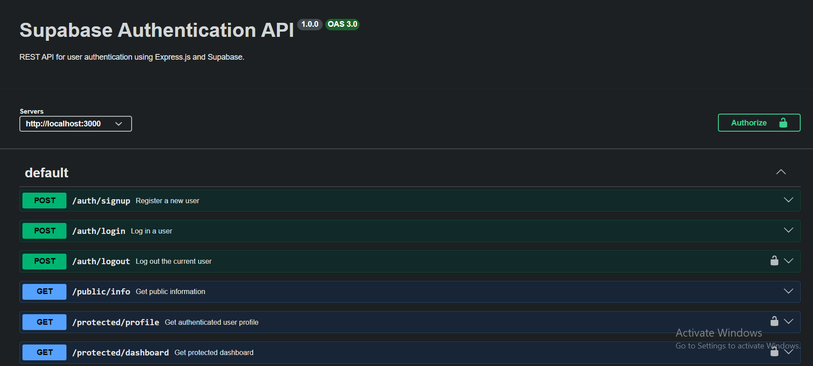

# Supabase Authentication API

A REST API built with **Node.js**, **Express.js**, and **Supabase Authentication**.

This project demonstrates a complete authentication system with:

* User registration
* User login
* JWT access-token authentication
* Protected routes
* Reusable authentication middleware
* User logout
* Public and protected endpoints
* Swagger UI documentation with Bearer authentication

The project is designed so that another developer can clone the repository, add their own Supabase credentials, and run the API with a single command.

---

# Technologies Used

* Node.js
* Express.js
* Supabase
* Supabase JavaScript SDK
* JWT access tokens
* Swagger UI Express
* OpenAPI 3.0
* dotenv
* Git & GitHub

---

# Project Structure

```text
auth-practice/
│
├── server.js
├── supabase.js
├── authMiddleware.js
├── openapi.json
├── package.json
├── package-lock.json
├── .env.example
├── .gitignore
├── README.md
└── swagger-screenshot.png
```

---

# Environment Variables

The project uses environment variables for the Supabase credentials.

Create a `.env` file in the project root:

```env
SUPABASE_URL=your_supabase_project_url
SUPABASE_KEY=your_supabase_anon_key
PORT=3000
```

You can use `.env.example` as a template:

```env
SUPABASE_URL=your_supabase_project_url
SUPABASE_KEY=your_supabase_anon_key
PORT=3000
```

Replace the placeholder values with the values from your Supabase project.

### Important

Never commit the real `.env` file or your Supabase credentials to GitHub.

The `.env` file is included in `.gitignore`.

The repository only contains `.env.example` with placeholder values.

---

# Supabase Setup

Create a Supabase project and obtain the following values from the Supabase dashboard:

* Project URL
* Anon key

Add them to your local `.env` file.

For this practice project, email confirmation was disabled in the Supabase Authentication settings so newly registered users can log in immediately.

---


Install the dependencies:

```bash
npm install
```

Create your environment file:

```text
.env
```

Copy the variables from `.env.example` and add your own Supabase credentials.

---

# Run the Project

After creating `.env`, start the complete API with:

```bash
npm start
```

The server runs on:

```text
http://localhost:3000
```

Swagger UI is available at:

```text
http://localhost:3000/api-docs
```

---

# API Reference

| Method | Endpoint               | Description                            | Authentication |
| ------ | ---------------------- | -------------------------------------- | -------------- |
| POST   | `/auth/signup`         | Register a new user                    | ❌ No           |
| POST   | `/auth/login`          | Log in and receive JWT tokens          | ❌ No           |
| GET    | `/public/info`         | Return public information              | ❌ No           |
| GET    | `/protected/profile`   | Return authenticated user's profile    | ✅ Yes          |
| GET    | `/protected/dashboard` | Return protected dashboard information | ✅ Yes          |
| POST   | `/auth/logout`         | Log out the authenticated user         | ✅ Yes          |

---

# Authentication Flow

The authentication flow works as follows:

```text
User
 │
 ├── POST /auth/signup
 │       │
 │       ▼
 │    Supabase
 │
 ├── POST /auth/login
 │       │
 │       ▼
 │    Access Token (JWT)
 │
 └── Protected Request
         │
         ▼
 Authorization: Bearer <access_token>
         │
         ▼
 Authentication Middleware
         │
         ▼
 Supabase verifies token
         │
         ▼
 Protected Route
```

The authentication middleware extracts the JWT from the `Authorization` header and asks Supabase to verify it.

If the token is invalid or expired, the API returns:

```json
{
  "error": "Invalid or expired token"
}
```

---

# API Examples

## 1. Sign Up

Register a new user:

```bash
curl -i -X POST http://localhost:3000/auth/signup \
-H "Content-Type: application/json" \
-d '{"email":"test@example.com","password":"password123"}'
```

A successful request returns:

```text
HTTP/1.1 201 Created
```

with the created user information.

---

## 2. Login

Log in with the registered account:

```bash
curl -i -X POST http://localhost:3000/auth/login \
-H "Content-Type: application/json" \
-d '{"email":"test@example.com","password":"password123"}'
```

A successful login returns an access token and refresh token.

Example:

```json
{
  "access_token": "eyJ...",
  "refresh_token": "..."
}
```

The `access_token` is used when accessing protected endpoints.

---

## 3. Public Information

The public endpoint does not require authentication:

```bash
curl -i http://localhost:3000/public/info
```

Example response:

```json
{
  "message": "Welcome stranger! This info is public."
}
```

---

## 4. Protected Profile

The profile endpoint requires a valid access token:

```bash
curl -i http://localhost:3000/protected/profile \
-H "Authorization: Bearer <YOUR_ACCESS_TOKEN>"
```

A successful request returns information about the authenticated user:

```json
{
  "id": "user-id",
  "email": "test@example.com",
  "created_at": "2026-07-29T16:12:19.17998Z"
}
```

Without a token, the API returns:

```text
HTTP/1.1 401 Unauthorized
```

---

## 5. Protected Dashboard

The dashboard endpoint uses the same authentication middleware:

```bash
curl -i http://localhost:3000/protected/dashboard \
-H "Authorization: Bearer <YOUR_ACCESS_TOKEN>"
```

A valid token allows access.

An invalid or expired token returns:

```text
HTTP/1.1 401 Unauthorized
```

---

## 6. Logout

Logout is also a protected endpoint:

```bash
curl -i -X POST http://localhost:3000/auth/logout \
-H "Authorization: Bearer <YOUR_ACCESS_TOKEN>"
```

A successful logout returns:

```text
HTTP/1.1 204 No Content
```

---

# Swagger UI

Swagger UI provides interactive API documentation.

Open:

```text
http://localhost:3000/api-docs
```

The protected endpoints use Bearer authentication.

Click **Authorize**, enter:

```text
Bearer <YOUR_ACCESS_TOKEN>
```

Then you can use **Try it out** to test the protected endpoints directly from Swagger.



---

# Security

Sensitive credentials are stored in `.env`.

The `.env` file must never be committed to GitHub.

The repository contains `.env.example` instead:

```env
SUPABASE_URL=your_supabase_project_url
SUPABASE_KEY=your_supabase_anon_key
PORT=3000
```

The `.gitignore` file contains:

```gitignore
node_modules/
.env
```

The Supabase **anon key** is intended for client-side use, but the real environment file is still kept out of the repository.

Never put the Supabase `service_role` key in this project.

---

# Running From a Clean Clone

A new developer can run the project without any manual database setup.

After cloning the repository:

```bash
npm install
```

Create `.env` from `.env.example`:

```text
.env.example → .env
```

Add the developer's own Supabase credentials, then run:

```bash
npm start
```

The API will be available at:

```text
http://localhost:3000
```

Swagger will be available at:

```text
http://localhost:3000/api-docs
```

No local database installation or manual database setup is required because authentication is handled by Supabase.

---


---


A peer should be able to:

1. Clone the repository.
2. Run `npm install`.
3. Create `.env` using `.env.example`.
4. Add their own Supabase credentials.
5. Run `npm start`.
6. Open `/api-docs`.
7. Register and log in.
8. Use the returned access token to access protected endpoints.

The project does not require a manually configured local database.

---


